# Cyber Sahayata

## What this is

Cyber Sahayata is a working prototype of a redesigned Indian cybercrime reporting portal.

On the real portal, a victim has to classify their own crime before they can describe it. You pick between
legal categories like "phishing" and "identity theft" while the money is still moving. You finish a long form
before anyone tells you to freeze the account. Then you get a reference number and silence. No named owner,
no deadline, no way to escalate.

This prototype inverts that order. It asks eight everyday yes or no questions and does the classification for
you. It shows the urgent protective steps before the form continues. It lets you file with an identity or
anonymously, with the tradeoff stated in plain words.

Every report ends with a published case plan: the sections of law, a named officer, dated deadlines, and a
five level escalation ladder that unlocks by itself when a deadline is missed.

There is a matching authority portal. The officer sees the same clock, sees the victim's identity masked by
default, and has to ask the citizen in writing to unmask it.

Everything is demo data in your browser. Nothing is filed with any government system.

## Start here

**Live: https://cyber-sahayata.pages.dev/**

The older link <https://vaibhavkumar.is-a.dev/build-what-moves-india2/> now forwards here automatically, carrying
the query string and the hash with it, so any deep link shared earlier still lands on the right screen.

Two minutes, three links, in this order:

1. [`/?e2e=reset#/`](https://cyber-sahayata.pages.dev/?e2e=reset#/) The home page. Three buttons, then the 1930 helpline block.
2. [`/?e2e=draft#/report/review`](https://cyber-sahayata.pages.dev/?e2e=draft#/report/review) A complete report, filled in, ready to check. This is what the citizen journey produces.
3. [`/?e2e=login#/reports/r-2`](https://cyber-sahayata.pages.dev/?e2e=login#/reports/r-2) A case that has missed its deadline, with a named officer and a live "Escalate to level 2" button. This is the argument.

You never need a password from us. Open [`/#/login`](https://cyber-sahayata.pages.dev/#/login) and the demo account is printed on screen in a blue box at the top: `demo@example.com` / `Demo@123`, with a "Use demo account" button under it that fills both fields and signs you in. The officer portal at [`/#/admin/login`](https://cyber-sahayata.pages.dev/#/admin/login) prints its whole six officer roster the same way, with a "Use this account" button on each row.

Two things to know before you click anything:

- The query string goes **before** the hash. `?e2e=draft#/report/review` works. `#/report/review?e2e=draft` does not.
- The header has a green "Report by chat" button on every page. That is a separate AI intake path with live model calls of 10 to 25 seconds per reply. Ignore it for the walkthrough, or open the finished conversation at [`/?e2e=chat#/chat`](https://cyber-sahayata.pages.dev/?e2e=chat#/chat), which needs no network call.

## The five minute tour

**1. The front door.** [`/?e2e=reset#/`](https://cyber-sahayata.pages.dev/?e2e=reset#/)

**Look at:** three buttons, "Start a report", "Track my report", "Get immediate help", then a red bordered 1930 block, then three plain steps. A grey strip at the top says this is a prototype and no real complaint is filed.

**Why it matters:** a victim in panic gets one obvious action, at reading age, instead of a wall of government links.

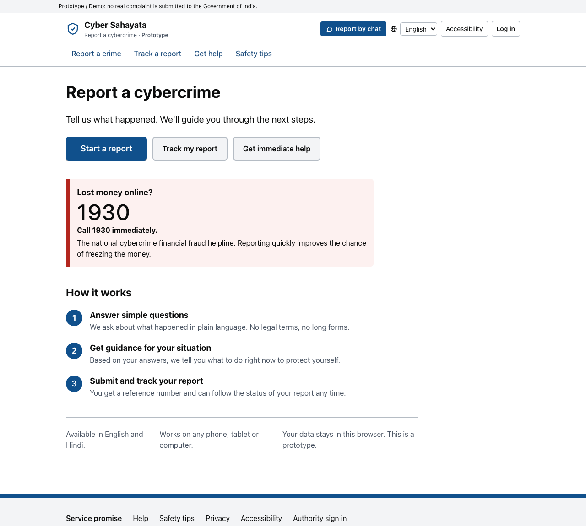

**2. Tracked or anonymous, decided before you give up anything.** [`/?e2e=reset#/report`](https://cyber-sahayata.pages.dev/?e2e=reset#/report)

**Look at:** the emergency helpline block is the very first element on this page, above the seven point "What will happen" list and the ten minute estimate. Then a required choice between "Register and track" and "Report anonymously". Open "What does each choice mean?" for the honest comparison. Pressing "Register and track" while signed out sends you to the login page and keeps your choice.

**Why it matters:** the real portal makes you sign up before it tells you anything. Anonymity is offered with its cost stated, not sold as free.

**3. Eight plain questions, then advice before paperwork.** [`/?e2e=draft#/report/questions`](https://cyber-sahayata.pages.dev/?e2e=draft#/report/questions) then [`/?e2e=draft#/report/guidance`](https://cyber-sahayata.pages.dev/?e2e=draft#/report/guidance)

**Look at:** one question per screen, starting with "Is anyone in immediate danger right now?", with Yes, No and Not sure all valid. Under question one only is the escape hatch: "I already know what kind of incident this is. Skip these questions." The seed has already answered all eight, so each opens pre selected. The guidance page then lists the protective actions for the classified category, with phone numbers as big tappable links, before the form continues.

**Why it matters:** nobody has to know the word "phishing", and in fraud the first hour decides whether the money can be frozen.

**4. Check your answers, and the same page anonymously.** [`/?e2e=draft#/report/review`](https://cyber-sahayata.pages.dev/?e2e=draft#/report/review) then [`/?e2e=anon#/report/review`](https://cyber-sahayata.pages.dev/?e2e=anon#/report/review)

**Look at:** five cards. Four of them, About you, Location, What happened and Evidence, have an Edit link straight back to that step. Immediate actions is a reminder, so it has none. Now open the anonymous version: the About you card is replaced by a plain statement of what was given up, and the stepper reads "Step 4 of 4" where the tracked journey reads "Step 5 of 5".

**Why it matters:** the identity step is removed from the journey, not just hidden, and nothing is submitted blind.

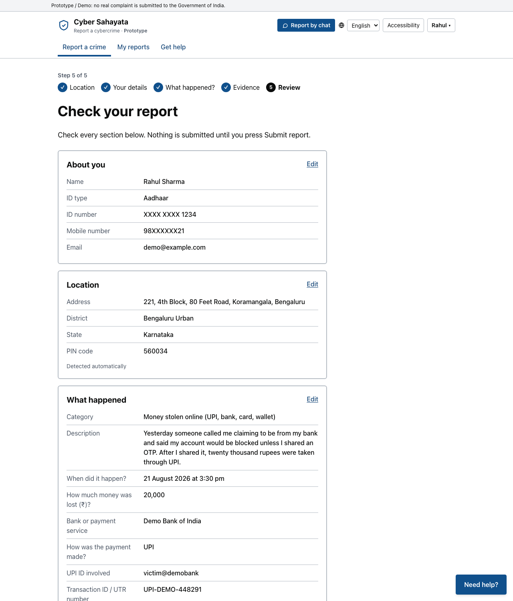

**5. The ending, which is the point.** [`/?e2e=login#/report/success`](https://cyber-sahayata.pages.dev/?e2e=login#/report/success)

**Look at:** a green confirmation panel with a 14 digit reference number, a 1930 banner because the seeded case is financial fraud, then the eight part case plan: what this is in law, what happens next and by when, who owns it, how you will hear from them, how to track it, the five level escalation matrix, how the case can end, and what the law provides on conviction. The summary list and the download button sit below the plan.

**Why it matters:** the usual ending is a number and silence. The citizen leaves knowing the named owner, the dates, and the escalation path. Note that this URL replays the newest seeded report, r-2, rather than filing a fresh one, and that the statutes are a hand written table in `src/content/casePlans.ts`, not model output.

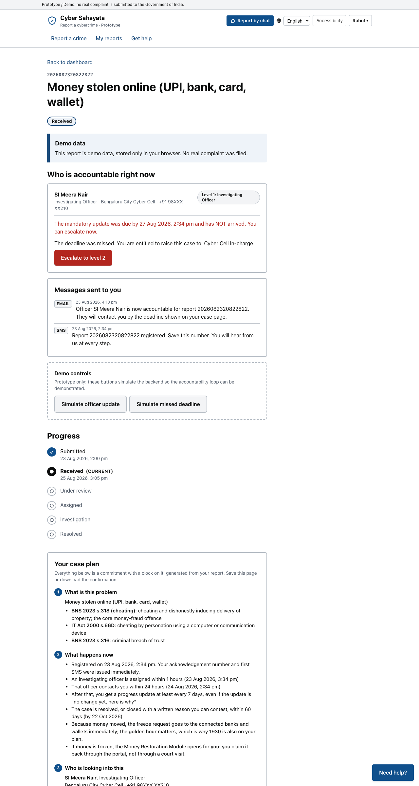

**6. A deadline missed, and the ladder it arms.** [`/?e2e=login#/reports/r-2`](https://cyber-sahayata.pages.dev/?e2e=login#/reports/r-2)

**Look at:** the "Who is accountable right now" card names SI Meera Nair, Investigating Officer, Bengaluru City Cyber Cell, with a chip reading "Level 1: Investigating Officer", a line saying the mandatory update was due and has not arrived, and a solid red "Escalate to level 2" button that is live the moment you land. Check the public lookup first at [`/#/track`](https://cyber-sahayata.pages.dev/#/track): paste r-2's reference from the dashboard (on 29 August 2026 it is `2026082320822822`) and the overdue date shows in red to anyone holding the number, with the description, evidence and identity withheld. Then walk the ladder with the dashed Demo controls card, which sits at the foot of the accountability section above the timeline: press "Escalate to level 2", then "Simulate missed deadline", then "Escalate to level 3", and repeat that pair twice more. At Level 5 a "Draft the public escalation post" button appears. Compare with [`/?e2e=login#/reports/r-1`](https://cyber-sahayata.pages.dev/?e2e=login#/reports/r-1), where the escalate button is correctly locked because that case is inside its deadline.

**Why it matters:** the missed deadline is detected by the portal and it arms the citizen's right to escalate. Nobody has to phone a station and beg. Do the Track step before the walk, because escalating pushes the next update 48 hours into the future and the date turns black again.

**7. The other side of the desk.** [`/?e2e=adminlogin#/admin/tickets/r-2`](https://cyber-sahayata.pages.dev/?e2e=adminlogin#/admin/tickets/r-2)

**Look at:** the reporter's name, document, email, mobile and address are all dots, while the evidence is fully visible: the UPI id `fraudpay@okbank`, the transaction id, the amount, the screenshots. Press "Request identity details from reporter", type a reason such as "Needed to name the complainant in the FIR", and send it. Nothing unmasks. Now open [`/?e2e=login#/reports/r-2`](https://cyber-sahayata.pages.dev/?e2e=login#/reports/r-2) as the citizen, where a panel quotes the officer's reason and offers Approve or Deny, and press Approve. Go back to [`/#/admin/tickets/r-2`](https://cyber-sahayata.pages.dev/#/admin/tickets/r-2): the officer session is still live, the values are there, and the Activity log carries a Reporter tagged entry. Finish at [`/?e2e=adminticket#/admin/tickets/r-2/fir-prep`](https://cyber-sahayata.pages.dev/?e2e=adminticket#/admin/tickets/r-2/fir-prep), the FIR proforma with the case already arranged for the counter.

**Why it matters:** there is no admin override. Access is per officer, per ticket, granted by the person the data is about, and provable afterwards.

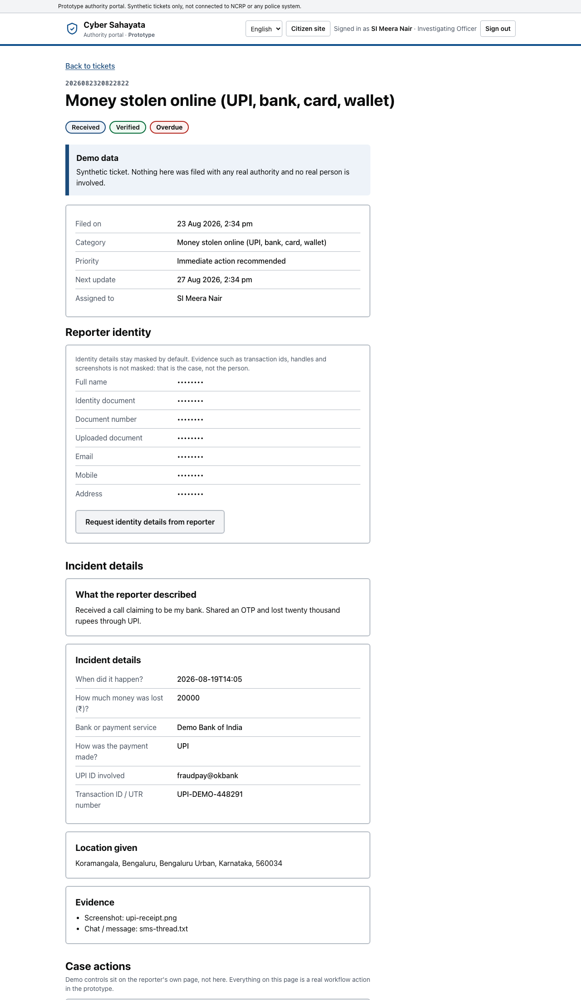

**Optional, if you have another minute.** [`/?e2e=chat#/chat`](https://cyber-sahayata.pages.dev/?e2e=chat#/chat) is a finished conversation where the victim just told their story and the panel beside it filled in category, amount, bank, UPI id and place. [`/?e2e=chatform#/chat`](https://cyber-sahayata.pages.dev/?e2e=chatform#/chat) shows that same conversation morphed into an editable pre filled form. Chat is an input method, not a black box that submits for you.

## Every screen, and what it solves

Query strings go before the hash. Any `#/report/*` step needs `?e2e=draft` or `?e2e=anon` to have content.

### Citizen side

| Screen | Open it | What it solves |
| --- | --- | --- |
| Home | `https://cyber-sahayata.pages.dev/?e2e=reset#/` | One obvious action for someone in panic, with the 1930 money fraud helpline on the page instead of in a footer. |
| Home in Hindi | `https://cyber-sahayata.pages.dev/?lang=hi#/` | A national service that only speaks English is useless. Every citizen facing string is translated. The footer link "Authority sign in" stays English, because the officer portal has no Hindi dictionary yet. |
| Sign in | `https://cyber-sahayata.pages.dev/#/login` | The demo account is printed on the page with a one click "Use demo account" button, so no judge has to hunt for credentials. |
| Accessibility settings | `https://cyber-sahayata.pages.dev/#/` then the Accessibility button in the header | Text size, high contrast and reduced motion as a real token swap on the html element, persisted, no install. There is no URL hook, you have to press the button. |
| Accessibility statement | `https://cyber-sahayata.pages.dev/#/accessibility` | Publishes what the controls do, six commitments, and four things this prototype honestly has not done, including no formal audit. |
| Privacy | `https://cyber-sahayata.pages.dev/#/privacy` | One page on what is collected, where it lives, and how to erase all of it. See the honesty gap note in "Things that are slow on purpose". |
| Service promise | `https://cyber-sahayata.pages.dev/#/promise` | Publishes the six stages, the escalation matrix and the deadline table for all 17 categories before you file, so a missed deadline is a breach of a written promise. |
| Start a report | `https://cyber-sahayata.pages.dev/?e2e=reset#/report` | Helpline first, then the full list of what will be asked, the ten minute estimate, and the tracked versus anonymous choice with the tradeoff spelled out. |
| Step 1, location | `https://cyber-sahayata.pages.dev/?e2e=draft#/report/location` | Citizens do not know which station owns their case. Pick an area, the system routes it. The seed arrives already detected. Use the "Or try a demo location" picker rather than the real browser location prompt. |
| Step 2, identity | `https://cyber-sahayata.pages.dev/?e2e=draft#/report/identity` | Typing an Aadhaar number on a phone is a common failure point, so this demonstrates the upload then review and edit pattern. The reading is simulated: `src/services/ocrService.ts` never opens the image, the fields are fixed demo values and the confidence figure is derived from the file name. |
| Step 3, triage questions | `https://cyber-sahayata.pages.dev/?e2e=draft#/report/questions` | Eight everyday questions classify the crime so the victim does not have to. Yes to the danger question raises the whole report to emergency. The skip link is on question one only. |
| Step 3, category | `https://cyber-sahayata.pages.dev/?e2e=draft#/report/category` | The user is told the answer instead of choosing from a legal taxonomy, and is never locked in. "Change category" reveals all 17. "What does this cover legally?" opens a plain language statute summary marked as not legal advice. |
| Step 3, guidance | `https://cyber-sahayata.pages.dev/?e2e=draft#/report/guidance` | Urgent protective actions arrive before the rest of the form, while the money can still be stopped. |
| Step 3, description | `https://cyber-sahayata.pages.dev/?e2e=draft#/report/description` | Opens in voice mode with a seeded transcript and an honest "Sample transcript inserted" label. Click "Type it" for the live character count towards 200 and the warning listing characters the real NCRP backend silently rejects. |
| Step 3, incident fields | `https://cyber-sahayata.pages.dev/?e2e=draft#/report/details` | Only the classified category's fields, and only "When did it happen?" blocks you. That field has an "I am not sure" option that swaps in a free text note, so a shaky memory never stops a submission. |
| Step 4, evidence | `https://cyber-sahayata.pages.dev/?e2e=draft#/report/evidence` | Screenshot, chat export, document, link, video and other all get a home, none of it mandatory. `upi-receipt.png` already carries a "File no longer in memory" badge, because the prototype refuses to pretend an upload happened. |
| Step 5, review | `https://cyber-sahayata.pages.dev/?e2e=draft#/report/review` | Check your answers with an Edit link on four of the five cards. Submitting clears the draft, so the `?e2e=draft` deep links bounce back to `#/report` until you reseed. |
| Step 5, review, anonymous | `https://cyber-sahayata.pages.dev/?e2e=anon#/report/review` | The same page with the About you card replaced by a plain statement, and the stepper at "Step 4 of 4". The identity step is removed from the route sequence, not hidden. |
| Submitted, with case plan | `https://cyber-sahayata.pages.dev/?e2e=login#/report/success` | A reference number plus the eight part case plan: law, deadlines, named owner, contact, tracking, escalation, endings, conviction. Anonymous submissions instead warn that the reference is the only record. |
| Dashboard | `https://cyber-sahayata.pages.dev/?e2e=login#/dashboard` | The demo account has two reports, r-1 account hacking under review and r-2 money stolen online and past its deadline, each with a named officer from the fixed roster. |
| Report r-2, overdue | `https://cyber-sahayata.pages.dev/?e2e=login#/reports/r-2` | Officer, missed deadline and an armed escalation button on first click. The dashed Demo controls card drives the ladder from Level 1 to Level 5 in about a minute. |
| Report r-1, healthy | `https://cyber-sahayata.pages.dev/?e2e=login#/reports/r-1` | The control case. Inside its deadline the escalate button is locked, which is what keeps the mechanism credible for the police side. |
| Level 5 post | `https://cyber-sahayata.pages.dev/?e2e=login#/reports/r-2` after four escalations | Public escalation as the last documented rung, not a random act. The draft carries only the reference number, the days since filing and a state police handle. Nothing is posted automatically. |
| Track without signing in | `https://cyber-sahayata.pages.dev/#/track` | Family members chase cases too. Anyone with the reference sees status, officer and the overdue deadline, and nothing private. Reference numbers are computed from today's date, so copy them from the dashboard. |
| Report by chat | `https://cyber-sahayata.pages.dev/?e2e=reset#/chat` | The same report as a conversation, for people who will never fill a form. "Continue anonymously" starts straight away, "continue signed in" goes to login first and says so. |
| Chat, finished | `https://cyber-sahayata.pages.dev/?e2e=chat#/chat` | An 11 message intake with the "What we understood" panel filled, a "Tone: Worried" chip and an amber "Needs fast action" banner telling the user to call 1930. No model call runs until you type. |
| Chat, as a form | `https://cyber-sahayata.pages.dev/?e2e=chatform#/chat` | The conversation becomes an editable pre filled form. The date row reads "When did it happen? (roughly when)" holding "yesterday evening" instead of an invented timestamp. |
| Need help panel | `https://cyber-sahayata.pages.dev/?e2e=draft#/report/review` | Help on every report step instead of a separate contact page. The panel never sends your draft, only the question you type and the language code. |
| Settings | `https://cyber-sahayata.pages.dev/?e2e=login#/settings` | "Clear demo data" wipes every report, draft and preference in one press, which is the honest end of a local only privacy claim. |

### Authority side

| Screen | Open it | What it solves |
| --- | --- | --- |
| Officer sign in | `https://cyber-sahayata.pages.dev/#/admin/login` | The whole six officer roster is printed with badge, rank, ticket count and a "Use this account" button, so a badge id always resolves to the same tickets. |
| Ticket queue | `https://cyber-sahayata.pages.dev/?e2e=adminlogin#/admin/tickets` | SI Meera Nair's two tickets, with the financial fraud one tagged Overdue in red. The deadline is the report's own `nextUpdateDue`, the same field the citizen tracking page reads. |
| Ticket, identity masked | `https://cyber-sahayata.pages.dev/?e2e=adminlogin#/admin/tickets/r-2` | Summary strip, then the Reporter identity card with every field as dots, then the case, then Case actions, then the Activity log. Evidence is never masked. That is the case, not the person. |
| Request identity | Same URL, "Request identity details from reporter" | No admin override. The officer states a purpose in words the citizen can judge, and the request is logged with name, timestamp and reason before anything unmasks. |
| Citizen approves | `https://cyber-sahayata.pages.dev/?e2e=login#/reports/r-2` | The person the data is about decides, on the page they already use. The two portals hold separate sessions, so you can flip between them in one browser. |
| Ticket, unmasked | `https://cyber-sahayata.pages.dev/#/admin/tickets/r-2` | Dots become values, and the grant is provable in the Activity log. It unlocks one case for one officer. The demo values are themselves partly redacted, since no real identity numbers exist anywhere here. |
| In charge, whole unit | `https://cyber-sahayata.pages.dev/#/admin/login`, then "Use this account" on Inspector Lakshmi Rao | Escalation level 2 has somewhere to land. This rank opens on "Whole unit" with 5 tickets and gets a reassign control. Do not reassign r-2, or the FIR step loses access to it. |
| FIR preparation pack | `https://cyber-sahayata.pages.dev/?e2e=adminticket#/admin/tickets/r-2/fir-prep` | The gap between an online complaint and an FIR at the counter. Sections are BNS 2023 and the IT Act, not the repealed IPC, read from the case plan file. The complainant block is filled only because the citizen granted access. |

## Screenshots

Every state below is a real capture of the live build, so you can judge the interface without clicking
anything. Each one links to the page that produced it.

### The citizen side

| | |
| --- | --- |
| [](https://cyber-sahayata.pages.dev/?e2e=reset#/)<br>**Home.** One obvious action, helpline on the page. | [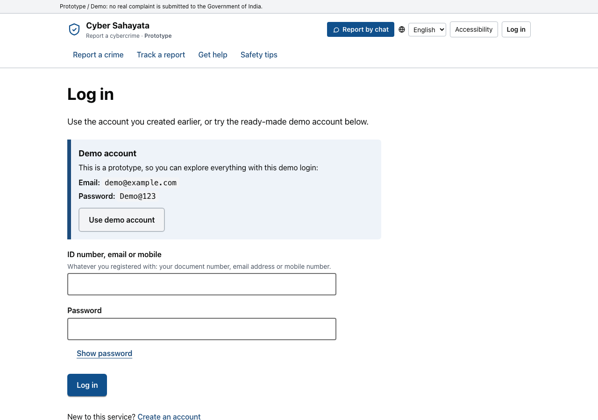](https://cyber-sahayata.pages.dev/#/login)<br>**Sign in.** The demo account is printed here with a one click button. |
| [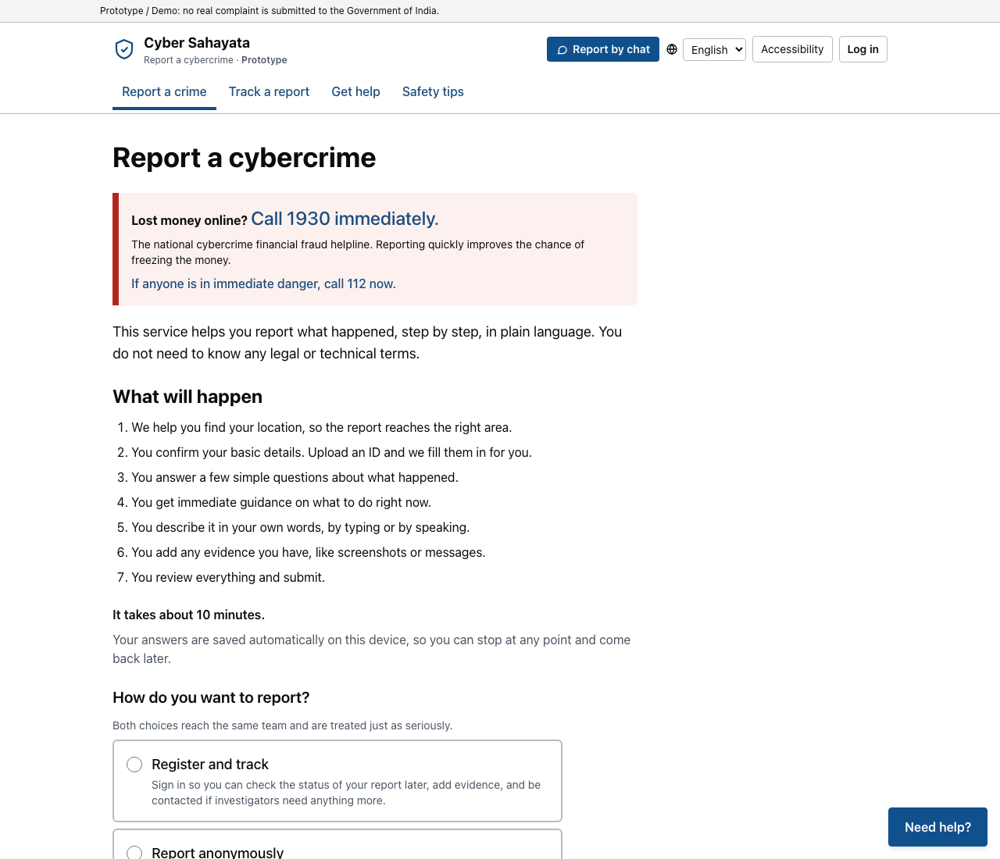](https://cyber-sahayata.pages.dev/?e2e=reset#/report)<br>**Start a report.** Tracked or anonymous, tradeoff stated. | [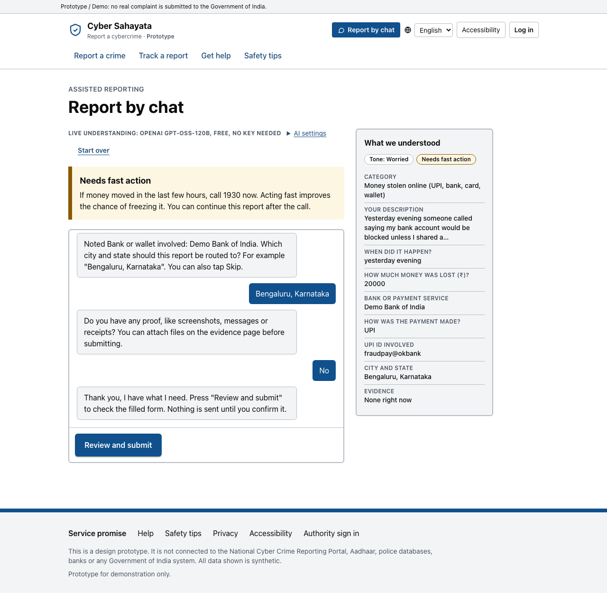](https://cyber-sahayata.pages.dev/?e2e=chat#/chat)<br>**Report by chat.** Plain language in, structured case out. |
| [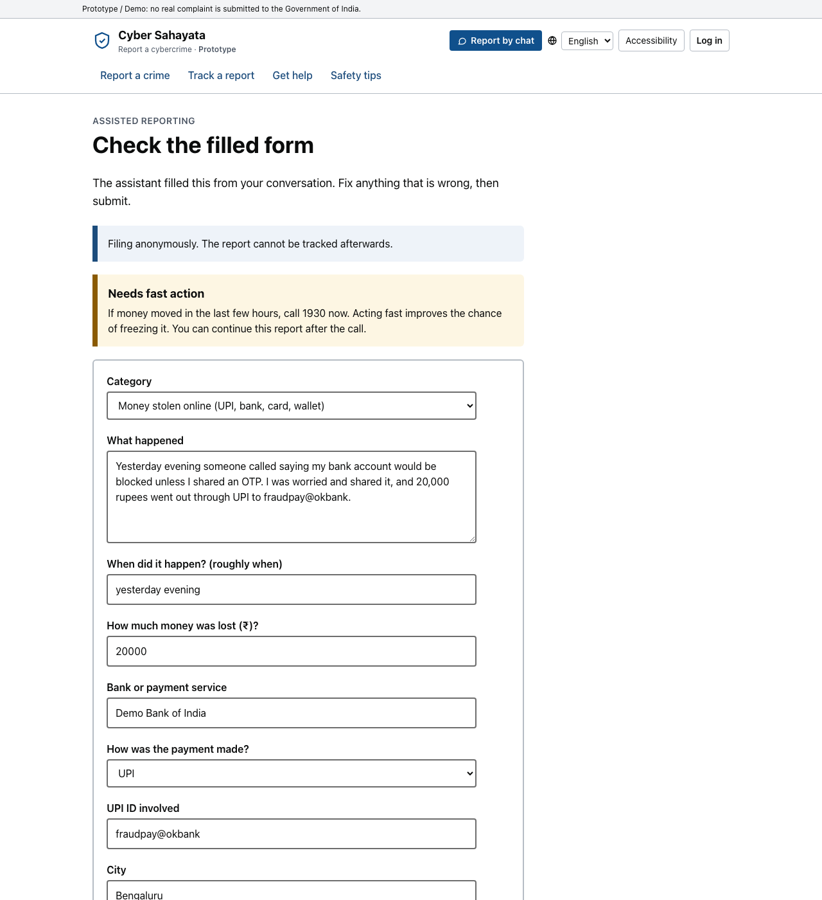](https://cyber-sahayata.pages.dev/?e2e=chatform#/chat)<br>**Chat becomes a form.** The conversation morphs into an editable draft. | [](https://cyber-sahayata.pages.dev/?e2e=draft#/report/review)<br>**Check your answers.** Edit links back to every step. |
| [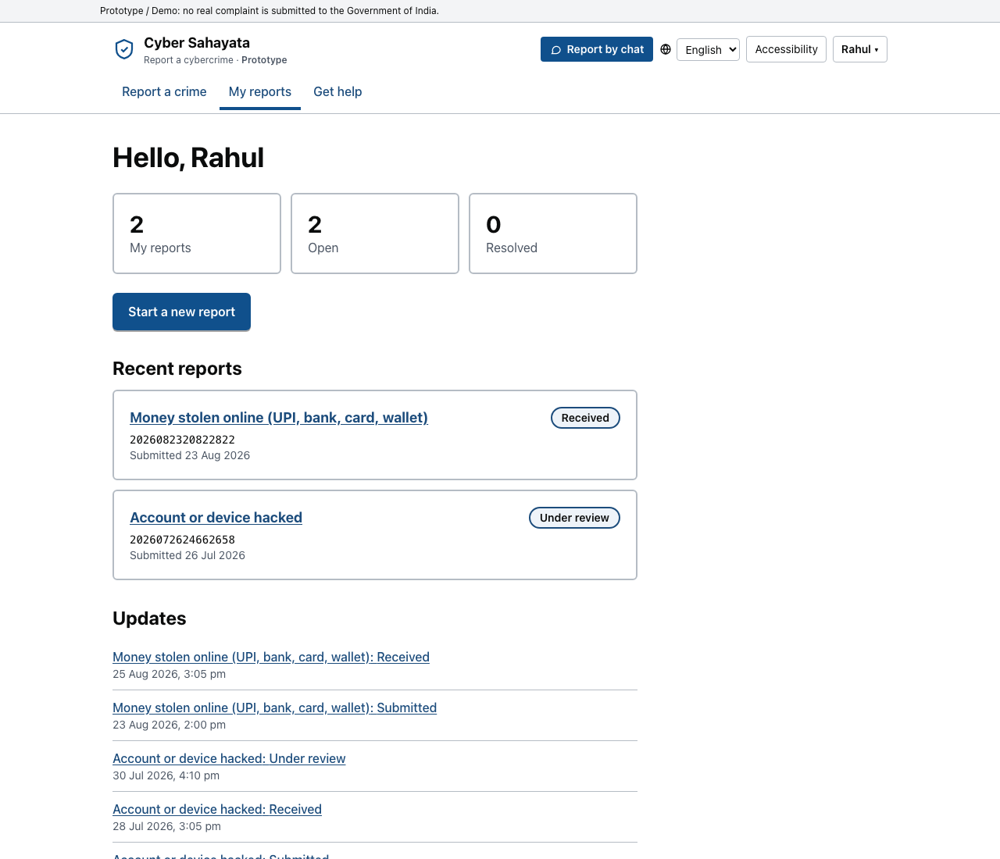](https://cyber-sahayata.pages.dev/?e2e=login#/dashboard)<br>**Dashboard.** Two cases, each with a named officer. | [](https://cyber-sahayata.pages.dev/?e2e=login#/reports/r-2)<br>**Case plan and escalation.** The main argument of the project. |
| [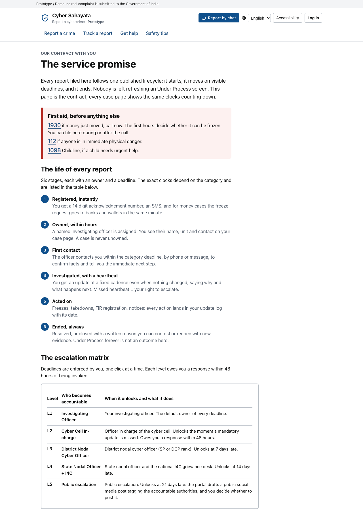](https://cyber-sahayata.pages.dev/#/promise)<br>**Service promise.** The deadlines published before you file. | [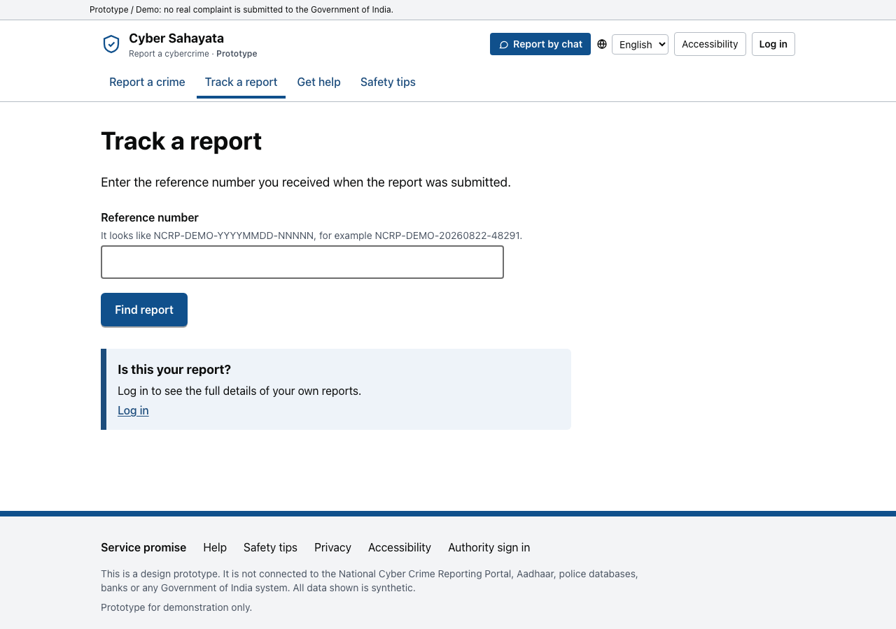](https://cyber-sahayata.pages.dev/#/track)<br>**Track a report.** Status by reference number, no login. |
| [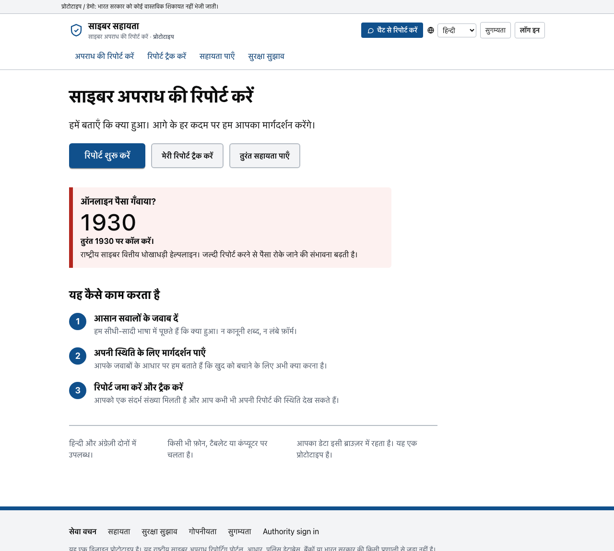](https://cyber-sahayata.pages.dev/?lang=hi#/)<br>**Hindi.** The whole citizen journey is translated. | |

### The authority side

| | |
| --- | --- |
| [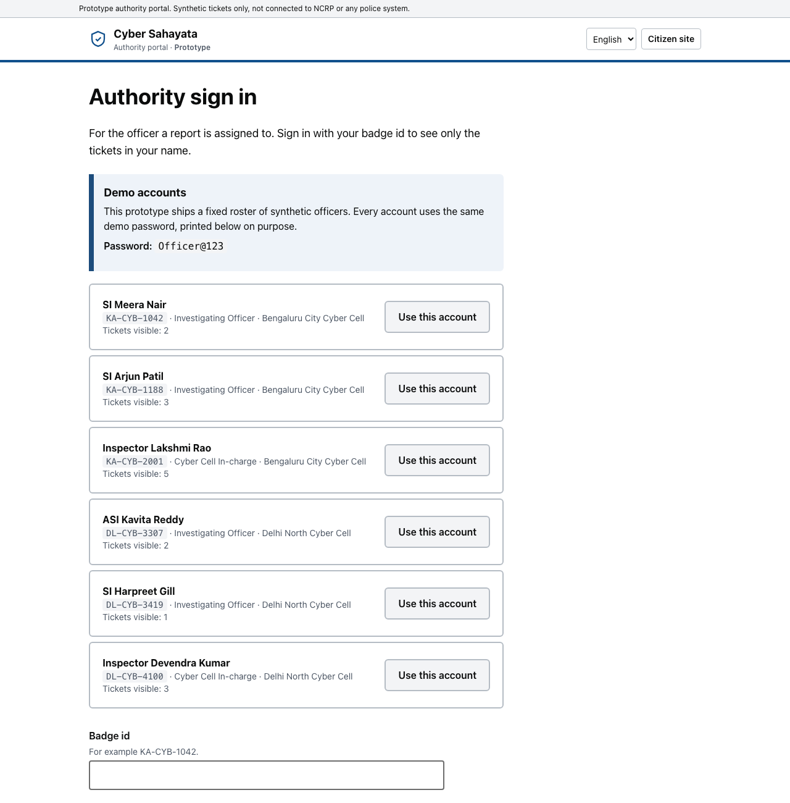](https://cyber-sahayata.pages.dev/#/admin/login)<br>**Authority sign in.** The whole demo roster, one click each. | [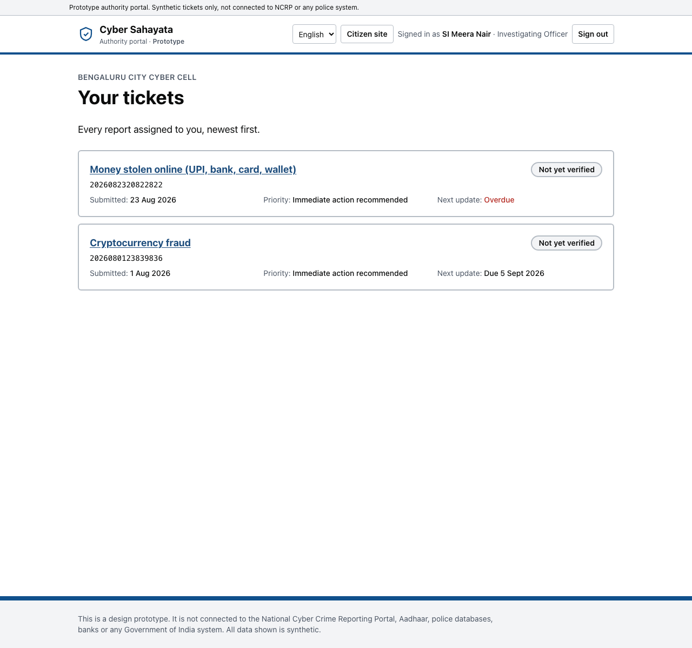](https://cyber-sahayata.pages.dev/?e2e=adminlogin#/admin/tickets)<br>**Ticket queue.** The officer's own cases and their clocks. |
| [](https://cyber-sahayata.pages.dev/?e2e=adminticket#/admin/tickets/r-2)<br>**Ticket detail.** Identity masked, evidence always visible. | [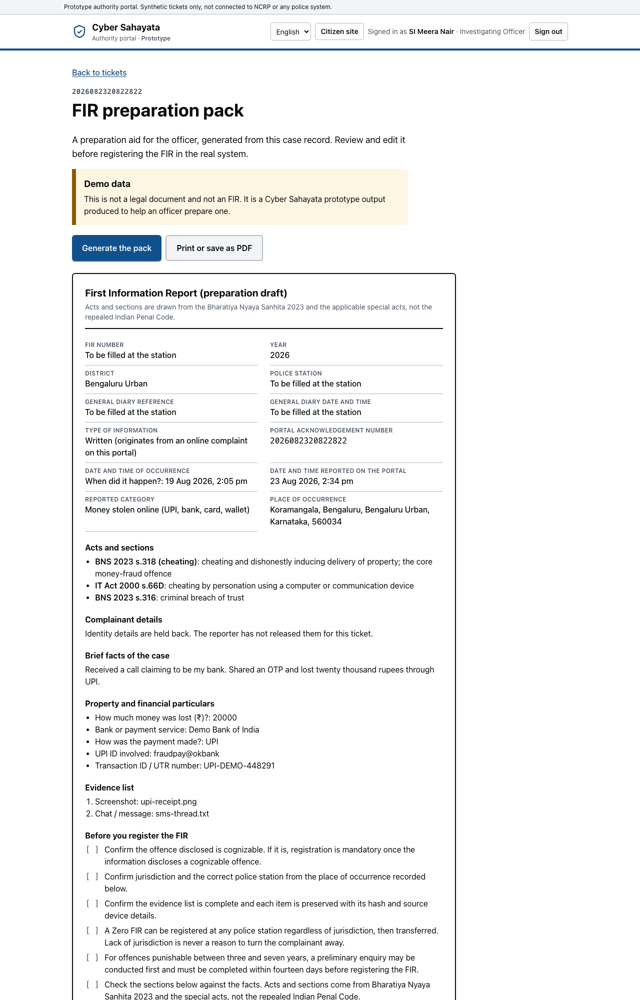](https://cyber-sahayata.pages.dev/?e2e=adminticket#/admin/tickets/r-2/fir-prep)<br>**FIR preparation pack.** Statutes from the code, not the model. |

## Demo accounts

Every account below is synthetic. No real person, badge, phone number or identity document exists anywhere in this prototype, and the identity values in the seed data are themselves pre redacted.

| Portal | Sign in with | Password |
| --- | --- | --- |
| Citizen | `demo@example.com` (Rahul Sharma) | `Demo@123` |
| Authority, investigating officer | badge `KA-CYB-1042` (SI Meera Nair) | `Officer@123` |
| Authority, cyber cell in charge | badge `KA-CYB-2001` (Inspector Lakshmi Rao) | `Officer@123` |

Both login pages print their own credentials on screen on purpose. On [`/#/login`](https://cyber-sahayata.pages.dev/#/login) a blue "Demo account" box shows the email and password as copyable text with a "Use demo account" button under them. On [`/#/admin/login`](https://cyber-sahayata.pages.dev/#/admin/login) all six officers are listed with badge, rank and a live count of the tickets that account can open, each with a "Use this account" button. In both cases the button fills the form and signs you in, so nothing has to be typed and no password has to be handed over separately. The `?e2e=login`, `?e2e=draft`, `?e2e=adminlogin` and `?e2e=adminticket` links in this README sign you in without the form at all.

## What the demo video covers

| Beat | Check it yourself |
| --- | --- |
| The problem: self classification and silence | `https://cyber-sahayata.pages.dev/?e2e=reset#/` |
| Tracked or anonymous, stated before any data is given | `https://cyber-sahayata.pages.dev/?e2e=reset#/report` |
| Eight plain questions replace the legal taxonomy | `https://cyber-sahayata.pages.dev/?e2e=draft#/report/questions` |
| Protective advice before the rest of the form | `https://cyber-sahayata.pages.dev/?e2e=draft#/report/guidance` |
| Voice input, transcribed on the device | `https://cyber-sahayata.pages.dev/?e2e=draft#/report/description` |
| Check your answers, then the anonymous version at Step 4 of 4 | `https://cyber-sahayata.pages.dev/?e2e=draft#/report/review` and `https://cyber-sahayata.pages.dev/?e2e=anon#/report/review` |
| The case plan: statutes, dates, named owner, escalation | `https://cyber-sahayata.pages.dev/?e2e=login#/report/success` |
| The published promise the case plan is measured against | `https://cyber-sahayata.pages.dev/#/promise` |
| A missed deadline arms escalation, level 1 to level 5 | `https://cyber-sahayata.pages.dev/?e2e=login#/reports/r-2` |
| The deadline is public, not hidden behind login | `https://cyber-sahayata.pages.dev/#/track` |
| Report by chat, and the same case as an editable form | `https://cyber-sahayata.pages.dev/?e2e=chat#/chat` and `https://cyber-sahayata.pages.dev/?e2e=chatform#/chat` |
| Officer sees the case, not the person | `https://cyber-sahayata.pages.dev/?e2e=adminlogin#/admin/tickets/r-2` |
| The citizen grants identity access, and it is logged | `https://cyber-sahayata.pages.dev/?e2e=login#/reports/r-2` then `https://cyber-sahayata.pages.dev/#/admin/tickets/r-2` |
| FIR preparation pack for the counter | `https://cyber-sahayata.pages.dev/?e2e=adminticket#/admin/tickets/r-2/fir-prep` |
| The same journey in Hindi | `https://cyber-sahayata.pages.dev/?lang=hi#/` |

## Things that are slow on purpose

Everything else in this prototype is local and instant. Five places make a live call, all of them opt in except one background download. If a spinner is running, it has not hung.

| Where | What it calls | Expect |
| --- | --- | --- |
| "Report by chat", typing a new message on `#/chat` | The prototype's Cloudflare worker `/intake`, running keyless Workers AI | 3 to 10 seconds, up to 25 if it falls through to a smaller model. Quick reply chips skip the model and are instant. Use `?e2e=chat` or `?e2e=chatform` to skip this entirely. |
| "Explain this in simple words", on the case plan and the success page | The worker's `/brief` route | 10 to 25 seconds, no streaming. The static bullets above it are the authoritative version and need no call. |
| "Need help?" floating panel on any `/report` step | The worker's `/ask` route | 2 to 8 seconds. On failure a canned keyword answer appears tagged DEMO, so it never dead ends. |
| "Generate the pack" on the FIR preparation page | The worker's `/fir-prep` route | 10 to 25 seconds, about 12 on a warm worker. The page itself loads instantly with a built in checklist. |
| Voice on `#/report/description` | Whisper tiny, downloaded from Hugging Face and run inside the browser | The recorder starts fetching roughly 40 MB in the background as soon as the page appears. First transcription is 10 to 25 seconds or longer on a slow link. The audio itself never leaves the device. |

Two honest notes on this. The `#/chat` page is the only place your account of the crime leaves the browser, capped at the last 12 messages and stored nowhere. The Privacy page says "Nothing is sent to any server", which is true of the form journey, the voice transcription, the identity upload and the evidence, but not of the chat page or the help panel. Those two screens carry their own accurate notices in place, and the Privacy page has not caught up yet.

---

# Technical information

Everything above is for evaluating the product. Everything below is for evaluating the build.

If you only look at one thing here, look at the architecture diagram in the next section. It shows the
boundary the whole project is designed around: what the model is allowed to decide, and what it is not.

## How it is built

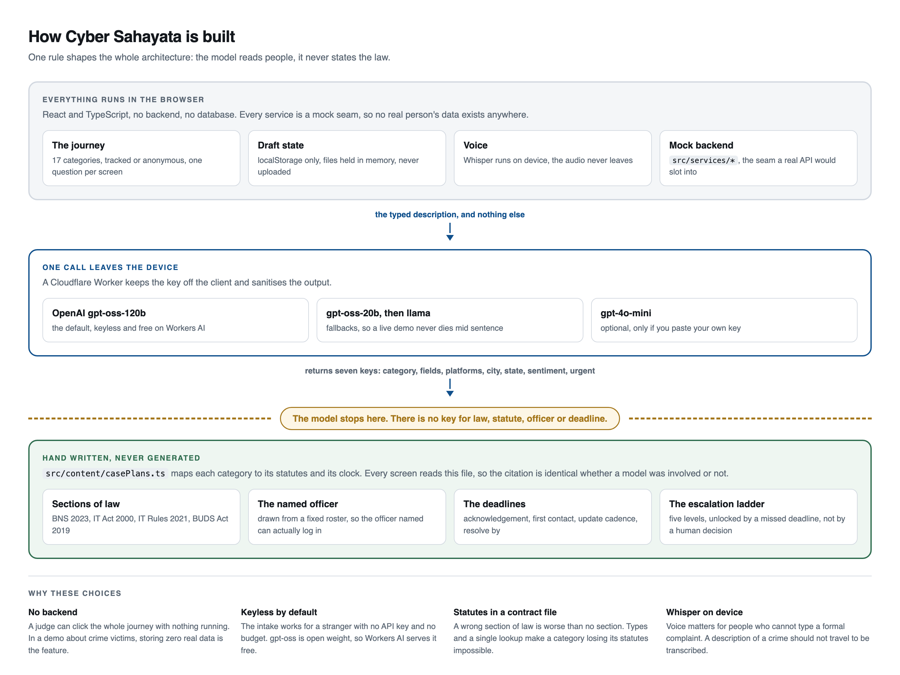

One rule shapes the whole architecture: the model reads people, it never states the law. The diagram is
generated from `docs/architecture.html`, so it can be regenerated rather than redrawn.


**React 18 + TypeScript (strict)**. The journey is a state machine over a draft object with conditional steps, so a typed model of that draft is what stops the branches (tracked vs anonymous, 17 category specific field sets) from drifting apart.

**Vite + Tailwind CSS v4**. Fast dev loop, one CSS token layer. High contrast mode is a token swap under `html[data-contrast="high"]`, not a filter, so it works on every component without per component work.

**React Router with `HashRouter`**. The site is served from GitHub Pages with `base: '/build-what-moves-india2/'`. Hash routes mean every deep link and every `?e2e=` hook works there without server rewrite rules.

**No backend, on purpose.** All state lives in `localStorage` under `ncrpdemo.*` keys, seeded from `src/data/demoData.ts`. The point of the prototype is the journey and the accountability model, not a database. Nothing is filed with any real system.

**The mock service seam.** `src/services/*` is the fake backend, one module per concern, each with a signature a real API could keep:

| Module | What it fakes |
| --- | --- |
| `authService` | Local users, SHA-256 password hashing, login by ID number, email or mobile |
| `reportService` | Report store, 14 digit acknowledgement numbers, officer assignment, escalation, public tracking |
| `geoService` | Asks the browser for real coordinates only on an explicit button press, then snaps them to one of six synthetic Indian addresses |
| `ocrService` | Reads nothing from the image. Document type comes from filename keywords, the extracted fields are fixed demo values, and the "match confidence" is 0.82 plus a filename hash, so it always lands between 82 and 91 percent |
| `sttService` | Real in browser Whisper, with a labelled canned transcript when the model cannot load |
| `deviceService` | A fixed documentation range IP (203.0.113.42). No fingerprinting |
| `adminService` | Ticket scoping, verification, the PII request and grant gate, the audit log |
| `firPrepService` | Builds the PII free FIR payload and calls the worker |

The UI never touches storage directly. Swapping a module body for `fetch` calls is the migration path.

**Cloudflare Worker (`worker/worker.js`, deployed as `sahayata-help`).** Four POST routes: `/intake`, `/ask`, `/brief`, `/fir-prep`. It exists so the AI features work for any visitor with no API key and no cost, using Cloudflare's keyless `[ai]` binding. It stores nothing.

**Leaflet + OpenStreetMap** for the optional map location picker, lazy loaded as its own chunk. A map is hard to use with a keyboard or a screen reader, so it is one of three location methods and the page says it is optional. Pins snap to the nearest synthetic demo city; there is no real geocoding.

**In browser Whisper via `@huggingface/transformers`.** Whisper tiny runs on device. Voice input is the accessibility feature that matters most here, and sending a victim's account of a crime to a speech API to get it would defeat the privacy claim. Cost: a roughly 40 MB model download from the Hugging Face hub on first use.

**Hand rolled i18n (`src/i18n/`).** English and Hindi, 12 namespace files per locale, flattened to dotted keys, `t()` falls back to English per key. No library, because the only real requirements were per key fallback and a runtime switch.

## Where the AI is, and where it deliberately is not

### The models

Free text chat messages on `#/chat` go to the worker's `/intake` route. Inside the worker the chain is, in order:

1. `@cf/openai/gpt-oss-120b` on Cloudflare Workers AI, keyless. This is the default for every visitor.
2. `@cf/openai/gpt-oss-20b` if the first errors or returns unparseable JSON.
3. `@cf/meta/llama-3.3-70b-instruct-fp8-fast` as the last attempt.
4. HTTP 502, which the client catches.

If the user pastes their own OpenAI key under "AI settings", `openaiExtract()` calls `api.openai.com` directly with `gpt-4o-mini`, temperature 0, `response_format: json_object`. The key stays in that browser's localStorage and goes only to OpenAI.

`/ask` (the floating "Need help?" panel) and `/fir-prep` use Groq `llama-3.3-70b-versatile` when a `GROQ_API_KEY` secret is set, otherwise keyless Workers AI. No Groq key is set on the deployed worker today, so those routes answer with provider `workers-ai`. Inside the keyless step of `/fir-prep`, gpt-oss goes before llama: llama answers but wraps its JSON in prose almost every time, so trying it first only bought a wait before the retry that works.

`/brief` (the "Explain this in simple words" button on the case plan) runs the same gpt-oss pair.

### What the model is allowed to decide

Exactly seven keys, defined once in `EXTRACTION_SPEC()` in `src/services/intakeService.ts` and sent to both OpenAI and the worker: `category`, `sentiment`, `urgent`, `fields`, `platforms`, `city`, `state`.

There is no key for law, statute, section, officer or deadline.

### Where the boundary is enforced in code

**Sections of law are never model output.** They are literals in the `statutes` array of each entry in `src/content/casePlans.ts`, looked up by category id through `casePlanFor()`. Every consumer reads that function and nothing else:

- `src/components/report/CasePlanPanel.tsx:45` (the citizen case plan)
- `src/pages/ReportDetail.tsx:47` (the report page)
- `src/pages/admin/AdminFirPrep.tsx:87` (the FIR pack)
- `src/services/reportService.ts:67` (deadlines at submit time)

So for financial fraud the citation is always BNS 2023 s.318, IT Act 2000 s.66D and BNS 2023 s.316, whether a model was involved or not. The most a model contributes is the category id, and even that is checked against `CATEGORIES`.

**`mergePatch()` (`src/services/intakeService.ts:542`) is a whitelist gate over the model's JSON.** Unknown field ids are dropped. Number fields must match a digits regex. Select fields must equal a declared option value. Date fields must start with `YYYY-MM-DD`. Greeting only strings are rejected. City and state must pass `isPlausiblePlace()`. Existing values are never overwritten. A hallucinating model can only fill fields that exist, with values of the right shape, in slots that are still empty.

**The FIR worker returns two things and no more.** `parseFirJson()` in `worker/worker.js` accepts only `{checklist, briefFacts}`, and rejects the response entirely if either is missing, falling through to the next provider. `requestFirPrep()` in `src/services/firPrepService.ts:133` re-validates the same two fields on the client. Statutes, dates, complainant block, property particulars and evidence list on the pack are assembled client side from the record. The model has no slot in which to invent a section.

**`/brief` can only restate.** `CasePlanPanel` flattens the static plan into a fact string and sends only that. If the worker fails, the static bullets stay and are the authoritative version.

**The questions are not model driven.** `nextSlot()` is a deterministic slot policy over the extraction state. Whichever brain read the message, the assistant asks the same next question. That is why the built in parser fallback still produces a coherent conversation.

**The help assistant is firewalled.** `helpService.ts` sends only the typed question and the language code. It never sends the draft, and the worker's system prompt tells it to refuse if a user pastes their incident story into it.

One indirect effect worth naming: the model's `urgent` boolean can raise a chat filed report from `standard` to `immediate` priority in `buildDraft()`. Deadlines still come only from the category's case plan.

## Data and privacy

Everything is demo data. Reports, users, officers and evidence come from `src/data/demoData.ts` and live in `localStorage` under `ncrpdemo.*`. There is no shared database. A report is only visible in the browser that filed it. Nothing is submitted to the National Cyber Crime Reporting Portal, Aadhaar, any police system or any bank.

No real personal data is stored anywhere. The seeded identity number is the literal string `XXXX XXXX 1234` and the seeded mobile is `98XXXXXX21`. There are no real identity numbers in the codebase.

What stays on device:

- The whole form journey, the draft, the review page and submission.
- Identity documents. `ocrService` never opens the file. The page says so.
- Evidence. File bytes live in an in memory `mediaCache` only, so after a refresh the app shows a "File no longer in memory" badge instead of pretending an upload happened.
- Voice. Whisper tiny runs in the browser. The audio never leaves the device.

What leaves the browser, all opt in, none of it automatic:

| Route | Sent | Notes |
| --- | --- | --- |
| `/intake` | Your chat messages, last 12, each truncated at 1500 characters | The only place your account of the crime leaves the device. One model call, stored nowhere |
| `/ask` | Your typed question and the UI language code | Never the draft |
| `/brief` | Facts already rendered on the case plan | Restatement only |
| `/fir-prep` | Category, statutes, description, incident fields, evidence list, place | Officer side. `buildFirPayload()` omits name, contact details, identity document and OCR output, even after identity access has been granted |
| `api.openai.com` | Chat messages, only if you paste your own key | Key kept in localStorage, sent only to OpenAI |
| Hugging Face hub | Nothing about you. The Whisper model download | First voice use only |
| OpenStreetMap tiles | Map tile requests, only if you open the map picker | |

One honesty gap you would otherwise find yourself: the Privacy page says "Nothing is sent to any server". That is true of the form, the identity upload, the evidence and the voice transcription. It is not true of the chat page or the help panel, which do call the worker. Both of those screens carry accurate notices in place, but the Privacy page has not been updated to mention them.

`#/settings` has a "Clear demo data" button that wipes every key. `?e2e=reset` does the same before the app boots.

## Test hooks

Query parameters go **before** the hash. `src/main.tsx` reads `window.location.search`, so `?e2e=draft#/report/review` works and `#/report/review?e2e=draft` does not. Seeding runs once at boot, so changing a hook needs a full reload.

| Hook | What it does |
| --- | --- |
| `?e2e=reset` | Wipes all demo localStorage, then reseeds the demo reports. Use it when a previous hook left you somewhere confusing |
| `?e2e=login` | Signs in the demo citizen (Rahul Sharma, `u-rahul`). No draft |
| `?e2e=draft` | Signs in the same citizen and seeds a complete tracked draft: Bengaluru address detected, Aadhaar identity, all 8 triage answers, category financial fraud, priority immediate, a voice description marked as a demo transcript, six money fields, two evidence items |
| `?e2e=anon` | Seeds the same case as an anonymous journey: no identity block, location method `map`, stepper drops to 4 steps. It does **not** sign you out, so run `?e2e=reset#/` first if you want to prove no account is needed |
| `?e2e=chat` | Seeds a finished 11 message chat intake on `#/chat`, in the "Review and submit" state. No model call runs until you type |
| `?e2e=chatform` | The same conversation already morphed into the pre filled editable form |
| `?e2e=adminlogin` | Signs in to the authority portal as SI Meera Nair, badge `KA-CYB-1042`. Separate session key from the citizen one |
| `?e2e=adminticket` | The same officer, plus report `r-2` marked verified, which is what unlocks the FIR prep page |
| `?lang=hi` / `?lang=en` | Not an `e2e` hook. Read in `src/i18n/index.tsx` at provider construction. Sets the starting language and combines with any hook: `?e2e=draft&lang=hi#/report/review`. The URL parameter is not persisted, so repeat it on each URL, or switch once with the header control, which does persist |

Any other `?e2e=` value is ignored and the app boots normally.

Two things to know before deep linking. Every `/report/*` step except `/report`, `/report/location` and `/report/success` needs a draft in storage, so use `?e2e=draft` or `?e2e=anon`, not `?e2e=login`. And pressing Submit clears the draft, so the deep links bounce back to `#/report` until you re-seed.

Report ids are stable (`r-1` through `r-8`), but acknowledgement numbers are computed from today's date. Deep link by id, not by reference number.

## Known limitations

1. **It is a prototype on mock data.** No real submission, no real identity verification, no real geocoding, no real OCR, no shared database. That is deliberate, but it means the hardest parts of a production build are the parts not built here.
2. **The ID reading is fully simulated.** `ocrService.ts` never opens the image. The document type comes from the filename, the extracted name, number and date of birth are constants, and the confidence figure is a filename hash, so it always reads 82 to 91 percent. What the screen demonstrates is the review and edit pattern, not OCR.
3. **Everything is per browser.** A report is only trackable on the device that filed it. Clearing site data destroys it.
4. **Uploaded files and recorded audio are held in memory only.** After a refresh the name and size survive, the contents do not. The evidence page shows a badge saying so rather than faking an upload.
5. **Whisper needs a first time download of roughly 40 MB.** The recorder starts fetching it on mount, so on `?e2e=draft#/report/description` the download begins as the page loads, before you press anything. Offline or on an unsupported browser it falls back to a canned transcript labelled "Sample transcript inserted". The seeded demo shows that label without any load having been attempted, so it names a failure that did not happen on your machine.
6. **Hindi covers the citizen side only.** The `admin` namespace has no Hindi file (`src/i18n/locales/hi/` has 12 files, `en/` has 13). `t()` falls back to English per key, so the whole authority portal reads in English with the Hindi switcher on. One English string also leaks onto citizen pages: the footer "Authority sign in" link, which resolves through `admin.citizenFooterLink`.
7. **The Privacy page overstates the position.** See the gap described in Data and privacy above.
8. **No formal accessibility audit and no testing with real assistive technology users.** The patterns follow GOV.UK conventions and the accessibility statement says both of these things on the page. Some live region announcements are likely imperfect.
9. **AI output can be wrong.** The chat extraction and the FIR checklist come from a model. The app labels the provider and falls back to a deterministic parser, but it does not claim the output is correct. The provider badge on the chat page is derived from configuration, not from what actually answered, so on the seeded conversation it names a model that never ran. The per turn notice under a message is the honest receipt.
10. **The chat is stricter than the form.** `missingFields()` requires every non optional field of the category. The classic form's `validate()` only blocks on the first field. Same field definitions, different enforcement.
11. **"Save as PDF" on the FIR pack is the browser print dialog**, not a generated file. No PDF library, nothing server side.
12. **Model latency is real.** `/intake` around 3 to 10 seconds, `/ask` around 3, `/brief` and `/fir-prep` 10 to 25. There is no streaming. Buttons show a loading state.
13. **No automated test suite in the repo.** The interactive flows (verification, PII grant, reassignment) were verified with a throwaway Chrome DevTools Protocol harness that was not kept. Screenshots and manual runs are the rest of it.
14. **Escalation state persists.** Walking the ladder on `r-2` leaves it at Level 5 for the session, and escalating pushes the next update 48 hours into the future, which hides the overdue styling on `#/track`. Reload `?e2e=reset` then `?e2e=login` to restore it.

## Run it locally

```bash
npm install
npm run dev        # Vite dev server
npm run build      # tsc --noEmit, then production build into dist/
npm run typecheck  # types only
npm run preview    # serve the production build
```

The dev server serves under the Vite base `/build-what-moves-india2/`, so open the URL Vite prints rather than bare `localhost:5173`.

The app runs with no configuration and no keys. The AI features point at the already deployed worker.

To run your own worker:

```bash
cd worker
npx wrangler deploy                      # keyless Workers AI, no secrets needed
npx wrangler secret put GROQ_API_KEY     # optional, switches /ask and /fir-prep to Groq
```

Then point `HELP_ENDPOINT`, `INTAKE_ENDPOINT`, `BRIEF_ENDPOINT` and `FIR_ENDPOINT` (in `src/services/helpService.ts`, `intakeService.ts` and `firPrepService.ts`) at your own `workers.dev` host.

For headless screenshots: the pages are `requestAnimationFrame` free, so use `--virtual-time-budget=8000 --timeout=20000` and a fresh `--user-data-dir` per run.